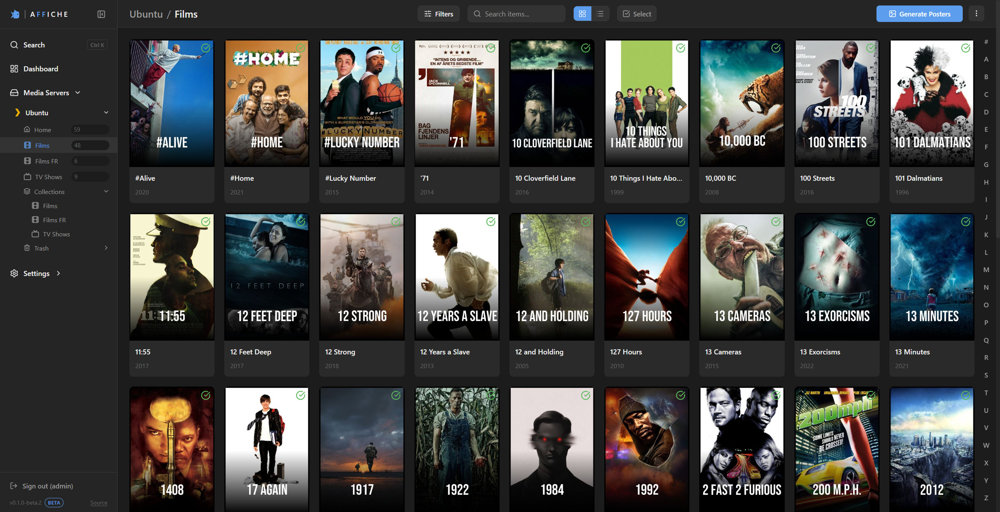
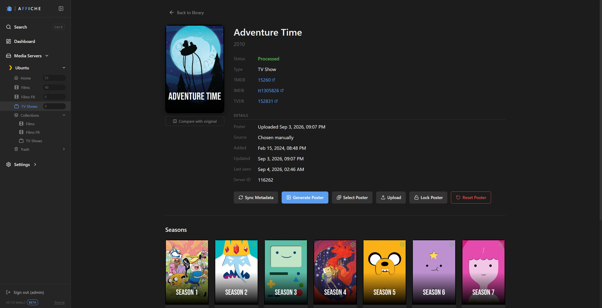
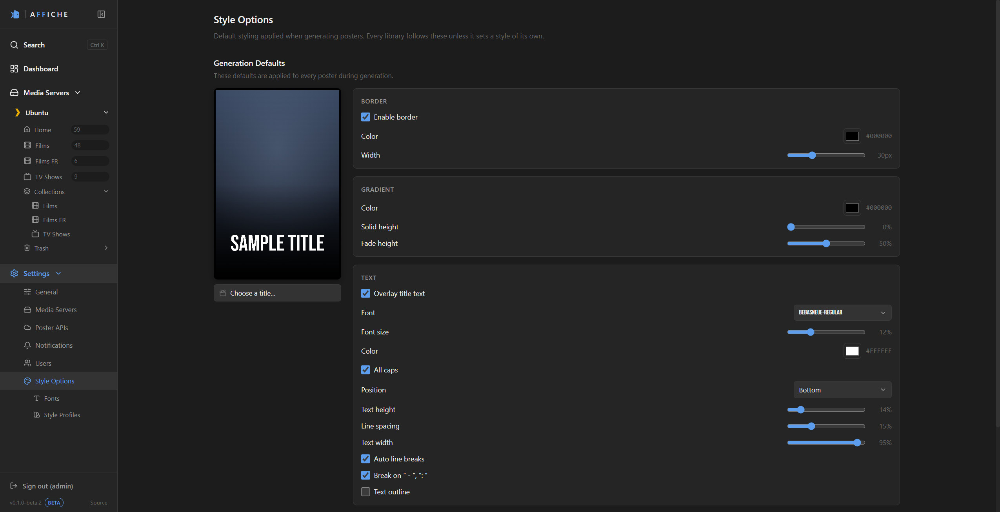
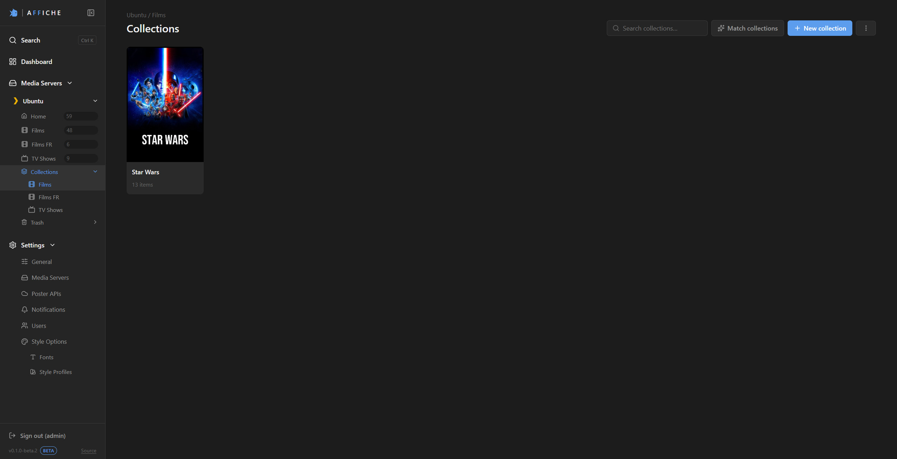

<div align="center">


# Affiche

**Custom posters for your Plex and Jellyfin libraries: generated, styled, and applied from a web UI.**

Customize the posters across your whole Plex or Jellyfin library. Self-hosted, one Docker container.

[](LICENSE)
[](#)
[](https://fastapi.tiangolo.com/)
[](https://react.dev/)

</div>

---

## What is Affiche?

Affiche fetches artwork from poster providers, decorates it with a style you set once (gradient
matte, border, vignette, grain, and the title typeset in a font you pick) and uploads the result
back to Plex or Jellyfin. You end up with a library that looks like one collection instead of a
patchwork of whatever each provider happened to have.

It all happens in the browser. Pick a library, hit **Generate**, watch the posters land.

## Why Affiche?

The premise: you see a poster before it reaches your library, and you can change your mind about
any one of them afterwards.

- **See it before you apply it.** The style controls preview on a real item from your own library.
  Move the gradient, change the font, adjust the border, and watch that poster redraw before it goes
  out to 3,000 of them.
- **Any item is a couple of clicks from an override.** Open it and browse what every provider has,
  side by side, or supply your own image by pasting a URL or picking a file. Nothing to edit in a
  config file, no run to re-trigger.
- **Nothing reaches your server until you say so.** Generated posters sit in Affiche's own store,
  upload when you are ready (or automatically at generation), and a reset puts back the artwork your server had before.
- **Posters, and nothing else.** Movies, shows, seasons, and collections. That narrow scope is what
  keeps the path from an idea to a finished library short.
- **One container, no moving parts.** SQLite and a single volume you back up by copying it.

## Features

**Poster generation**
- Artwork from **TMDB**, **TVDB**, **Fanart.tv**, **MediUX**, **TVmaze** and your own
  **Shoko Server**, in a provider order you control globally or per library
- Style engine: gradient matte, fade, border with corner radius, vignette, inner glow, film grain
  and blur, all previewed live
- Title text in bundled fonts or your own uploads, with colour, casing, auto-fitted size,
  positioning, and an outline stroke
- Artwork languages as a priority list per media server (textless, then English, then French by
  default). Each one is tried across every provider before the next is used
- Movies, shows, season posters, and collection posters
- Per-library style overrides, so an anime library and a kids library don't have to look alike

**Library management**
- Several media servers at once (Plex and Jellyfin side by side), each with several libraries
- Grid or table browsing, with various filter options
- Item detail with seasons, and per-episode file and quality info if you want it
- Bulk selection in the grid and the table: generate, upload, lock, unlock, or reset a selection of items
- Lock a poster to keep it as is, while sync, upload, and reset still work
- Collections synced from Plex and Jellyfin, opt-in per library
- Trash view, to restore or permanently drop items that vanished from the server

**Automation**
- Webhooks: Plex `library.new` and Jellyfin `ItemAdded` start a poster run for the new item
- Polling on a per-library interval, for servers that can't send webhooks
- Notifications to Discord, Gotify, Apprise, or any URL that takes a POST, when a run finishes,
  fails, or leaves items in an error state

**Operational**
- Dashboard with statistics
- One volume holds everything persistent: database, posters, fonts, logs, settings

## Screenshots

The library:



Items and seasons:



Style options:



Collections:



> ### 🧪 Public beta
>
> Affiche is at `0.1.0-beta.2`. It runs every day against real Plex library, but the
> beta label is honest: expect rough edges, and back up `/data/config` before upgrading. Bug reports
> and feedback are what this release is for, so please [open an issue](../../issues).

## Quick start

Affiche ships as one container. The API and the web UI run in the same process on the same port,
and there is a single volume to persist.

### Docker Compose (example)

```yaml
services:
  affiche:
    image: ghcr.io/neoge0/affiche:latest
    container_name: affiche
    ports:
      - "8000:8000"
    volumes:
      # The only mount, and the only thing to back up: database, posters, fonts,
      # logs, settings and generated secrets all live here.
      - affiche-config:/data/config
    restart: unless-stopped

volumes:
  affiche-config:
```

```bash
docker compose up -d
```

Then open <http://localhost:8000> and create your admin account.

### docker run

```bash
docker run -d --name affiche \
  -p 8000:8000 \
  -v affiche-config:/data/config \
  --restart unless-stopped \
  ghcr.io/neoge0/affiche:latest
```

### Build it yourself

```bash
git clone https://github.com/NeoGe0/affiche.git
cd affiche
docker compose -f affiche-backend/docker-compose.yml up -d --build
```

The build context is the repository root. The Dockerfile builds the React app and copies it into
the Python image, so `docker build .` from the root works too.

## First run

1. **Create the admin account.** The first visit lands on the setup screen, which only works while
   no admin exists.
2. **Add a media server** in *Settings → Media Servers*. Plex needs its URL and a token
   ([how to find yours](https://support.plex.tv/articles/204059436-finding-an-authentication-token-x-plex-token/));
   Jellyfin needs its URL and an API key (*Dashboard → API Keys*). Then pick which libraries Affiche
   should manage.
3. **Add at least one poster provider** in *Settings → Poster APIs*:
   [TMDB](https://www.themoviedb.org/settings/api) ·
   [TVDB](https://thetvdb.com/api-information) ·
   [Fanart.tv](https://fanart.tv/get-an-api-key/) ·
   [MediUX](https://mediux.pro).
   [TVmaze](https://www.tvmaze.com/api) needs no key at all and covers shows and seasons; Shoko is
   your own [Shoko Server](https://shokoanime.com/), so it takes that server's address and a key you
   generate there, and it only knows about anime already in your Shoko collection.
4. **Sync a library.** This imports items and metadata. No artwork is touched.
5. **Style your posters** in *Settings → Style Options*. Pick a real item from your library as the
   preview subject and tune until you like it.
6. **Generate**, look through the results, then **upload to the server** when you're happy.

Nothing is written to Plex or Jellyfin until you upload.

**Forgot your password?** There is no default and no email reset. Recover it from the host with:

```bash
docker exec affiche python -m affiche.cli reset-password
```

It prints a temporary password (also written to the log) and signs every session out. Log in with
it and Affiche will ask for a new password.

## Configuration

**No environment variable is required.** On first start Affiche writes its secrets to
`<CONFIG_DIR>/secrets.json` and reuses them from there. Set them yourself only if you want to manage
secrets externally, from a vault, or when replaying an install elsewhere:

| Variable | Default | What it does |
|---|---|---|
| `CONFIG_DIR` | `/data/config` (Docker) | Root of all persistent state. Every other path derives from it. |
| `ENCRYPTION_KEY` | generated | Encrypts stored Plex/Jellyfin/provider tokens. Any string works, it gets derived into a valid key. **Changing it makes stored tokens unreadable.** |
| `AUTH_SECRET` | generated | Signs the session cookie. Changing it just logs you out. |
| `DATABASE_URL` | SQLite under `CONFIG_DIR` | Only useful to move off SQLite. |

The table above is the whole surface — [`affiche-backend/.env.example`](affiche-backend/.env.example)
is a copy-pasteable stub of the same two variables.

**What lives in the volume**

```
/data/config
├── db/            SQLite database
├── posters/       generated posters + thumbnails
├── fonts/         your uploaded fonts
├── log/           application logs
├── secrets.json   generated encryption key + auth secret
└── *.json         app settings, poster style config
```

**Ports.** `8000` serves both the API (`/affiche/...`) and the web UI. Nothing else to expose.

**Webhooks.** Enable them per server in *Settings → Media Servers* and Affiche gives you a tokenized
URL to paste into Plex or Jellyfin. Apart from that token the endpoint is unauthenticated, so keep
the URL private.

## Development

Two apps, run side by side. The Vite dev server proxies `/affiche` to the backend, so there is no
CORS to deal with.

**Backend** (Python 3.11+)

```bash
cd affiche-backend
python -m venv venv
source venv/bin/activate        # Windows: venv\Scripts\activate
pip install -r requirements.txt
uvicorn affiche.main:app --reload --port 8000
```

State goes to `affiche-backend/data/config/` when `CONFIG_DIR` is unset. API docs at
<http://localhost:8000/docs>.

**Frontend** (Node 22.22+, 24.15+, or 26+; `engines` is enforced, see `package.json`)

```bash
cd affiche-frontend
npm install
npm run dev                     # http://localhost:3000
```

**Checks**

```bash
cd affiche-backend  && python -m pytest -q  # backend tests (venv activated)
cd affiche-frontend && npm run test         # frontend tests
cd affiche-frontend && npm run build        # typecheck + build, what the image build runs
cd affiche-frontend && npm run lint
```

`npx tsc --noEmit -p tsconfig.app.json` is quicker, but it skips the test files that `tsc -b`
compiles, so a type error only reachable from a `.test.tsx` passes there and fails the image build.

Database schema changes go through Alembic (`affiche/alembic/versions/`); the app runs
`alembic upgrade head` on startup.

## Stack

FastAPI · SQLAlchemy · Alembic · SQLite · Pillow · plexapi on the backend;
React 19 · TypeScript · Vite · React Router · Vitest on the frontend.

## Contributing

Issues and pull requests are welcome, bug reports especially while the beta is on. See
[CONTRIBUTING.md](CONTRIBUTING.md) for the setup, the checks CI runs, and where a change belongs.

Found a security issue? Please report it privately, see [SECURITY.md](SECURITY.md).

## License

Affiche is licensed under the **GNU Affero General Public License v3.0**, see [LICENSE](LICENSE).

In short: you may use, modify and redistribute it freely, but any modified version you distribute
**or run as a network service** has to be published under the same license, source included. That
is deliberate. It keeps Affiche open and stops it being repackaged as a closed product.

**Bundled fonts are not covered by the AGPL.** The 52 font files in `affiche-backend/resources/`
are third-party and stay under their own SIL Open Font License 1.1. See
[`affiche-backend/resources/FONTS.md`](affiche-backend/resources/FONTS.md) for the family list,
copyright notices, and license files.

## Disclaimer

Affiche is an independent project. It is not affiliated with, endorsed by, or sponsored by Plex,
Jellyfin, TMDB, TheTVDB, Fanart.tv, MediUX, TVmaze, or Shoko. Artwork is provided by those services
and remains subject to their own terms of use.
